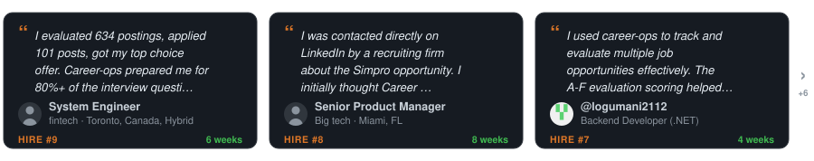

<p align="center"><picture><source media="(prefers-color-scheme: dark)" srcset="docs/wordmark-dark.svg"></picture></p>

<p align="center">
  <em>Passei meses me candidatando do jeito difícil. Então eu criei o sistema que eu queria ter.</em><br>
  Empresas usam IA para filtrar candidatos. <strong>Eu dei aos candidatos IA para <em>escolher</em> empresas.</strong><br>
  Ele avalia, classifica e redige. <strong>Nunca envia nada: quem envia é você.</strong> Open source, local, seu.
</p>

<p align="center">
  <a href="https://x.com/santifer/status/2041403685696053741"></a>
</p>

<p align="center"><sub>Um retrato no meio da busca: o pipeline, depois uma vaga aberta e avaliada do início ao fim.</sub></p>

<p align="center"><strong>De 740 vagas, 68 mereciam candidatura. 12 entrevistas. 1 oferta.</strong></p>
<p align="center"><sub>Uma única busca, a do autor, 2026. O número que importa é o corte, não a contagem. Todos os números no <a href="https://santifer.io/career-ops-system">case study</a>.</sub></p>

<p align="center"><sub>Nunca envia, nunca manda e-mail, nunca liga para casa: <a href="#o-que-o-career-ops-não-faz">o que ele não faz</a> · roda na CLI de IA que você já usa, <a href="docs/RUNNING_ON_A_BUDGET.md">com modelos gratuitos e locais incluídos</a>.</sub></p>

<details>
<summary>Leia em 17 idiomas</summary>
<div align="center">

[English](README.md) | [Español](README.es.md) | [Deutsch](README.de.md) | [Français](README.fr.md) | [Português (Brasil)](README.pt-BR.md) | [한국어](README.ko-KR.md) | [日本語](README.ja.md) | [简体中文](README.cn.md) | [繁體中文](README.zh-TW.md) | [Українська](README.ua.md) | [Русский](README.ru.md) | [Polski](README.pl.md) | [Dansk](README.da.md) | [العربية](README.ar.md) | [हिन्दी](README.hi.md)

</div>
</details>

<hr>

<p align="center">
  <a href="HIRED.md"></a>
</p>

<p align="center"><sub>Conseguiu a sua? <a href="https://github.com/career-ops-hq/career-ops/issues/new?template=i-got-hired.yml">Compartilhe →</a> · seu card mostra a alguém no meio da busca que existe saída.</sub></p>

<p align="center">
  <a href="HIRED.md"></a>
</p>

<p align="center"><sub>Cada número é uma história pública que você pode <a href="HIRED.md">auditar →</a> · todas começaram onde você está agora.</sub></p>

<p align="center"><sub>NA MÍDIA</sub></p>

<p align="center">
  <a href="https://wired.com.gr/article/to-ai-ergaleio-pou-fernei-epanastasi-ston-tropo-pou-psachnoume-douleia/" rel="noopener noreferrer nofollow"><picture><source media="(prefers-color-scheme: dark)" srcset="docs/press/wired-dark.svg"></picture></a>
  &nbsp;&nbsp;&nbsp;&nbsp;&nbsp;
  <a href="https://www.businessinsider.com/how-i-built-tool-filter-job-listings-landed-head-ai-2026-4" rel="noopener noreferrer nofollow"><picture><source media="(prefers-color-scheme: dark)" srcset="docs/press/business-insider-dark.svg"></picture></a>
</p>

<p align="center">
  <a href="https://www.producthunt.com/products/santifer-io?utm_source=badge-featured&utm_medium=badge" target="_blank"></a>
  &nbsp;&nbsp;
  <a href="https://trendshift.io/repositories/25195" target="_blank"></a>
</p>

<p align="center"><sub>Criado e mantido por <a href="https://santifer.io">Santiago Fernández de Valderrama Aparicio</a> (<a href="https://github.com/santifer">@santifer</a>)</sub></p>

## O que é isso

career-ops transforma qualquer CLI de código com IA em uma central completa de busca de emprego. Em vez de acompanhar candidaturas manualmente em planilha, você tem um pipeline com IA que:

- **Avalia vagas** com uma avaliação estruturada A-H (cinco dimensões que geram uma pontuação de 1-5)
- **Gera PDFs personalizados** -- CVs otimizados para ATS, ajustados por descrição de vaga
- **Escaneia portais** automaticamente (Greenhouse, Ashby, Lever, páginas de empresas)
- **Processa em lote** -- avalia 10+ vagas em paralelo com subagentes
- **Rastreia tudo** em uma única fonte de verdade com verificações de integridade

> **Importante: isso NÃO é uma ferramenta de disparo em massa.** career-ops é um filtro -- ajuda você a encontrar as poucas vagas que realmente valem seu tempo entre centenas. O sistema recomenda fortemente não se candidatar a nada com nota abaixo de 4.0/5. Seu tempo é valioso, e o do recrutador também. Sempre revise antes de enviar.

career-ops é agentic: Claude Code navega páginas de carreira com Playwright, avalia aderência comparando seu CV com a descrição da vaga (não por simples correspondência de palavras-chave) e adapta seu currículo para cada vaga.

> **Aviso: as primeiras avaliações não vão ser ótimas.** O sistema ainda não conhece você. Dê contexto -- seu CV, sua trajetória profissional, suas provas de resultado, suas preferências, no que você é bom e o que quer evitar. Quanto mais você alimenta, melhor ele fica. Pense nisso como o onboarding de um novo recrutador: na primeira semana ele precisa te conhecer, depois se torna indispensável.

Construído por alguém que o usou para avaliar 740 vagas, se candidatar a 68 e conseguir um cargo de Head of Applied AI. [Leia o case study completo](https://santifer.io/career-ops-system).

## O que o career-ops não faz

- **Enviar uma candidatura.** Ele prepara as respostas; você abre o formulário e clica em Enviar. O script nunca faz POST (`prepare-application.mjs`).
- **Mandar um e-mail.** Só rascunhos. Não existe nenhum transporte de e-mail em todo este código.
- **Ligar para casa.** Sem telemetria, sem backend nosso. Seu currículo vai da sua máquina para o provedor de IA que você escolheu, e para nenhum outro lugar. O único registro público é este repositório: `HIRED.md` e suas issues.
- **Empurrar você a se candidatar abaixo de 4.0/5.** Ele vai dizer para não fazer. Você pode ignorar, e ele vai avisar.

Ele reformula seu currículo; nunca deve inventá-lo. Hoje essa regra vive nos prompts, ainda não em uma verificação obrigatória. Leia cada currículo antes de enviar. Detalhes no [FAQ](#faq).

## Funcionalidades

| Funcionalidade                       | Descrição                                                                                                                                      |
| ------------------------------------ | ---------------------------------------------------------------------------------------------------------------------------------------------- |
| **Auto-Pipeline**                    | Cole uma URL e receba avaliação completa + PDF + entrada no tracker                                                                            |
| **Avaliação A-H**            | Resumo da vaga, aderência ao CV, estratégia de senioridade, pesquisa de compensação, personalização, preparação para entrevista (STAR+R) -- além de uma verificação de legitimidade da vaga (Bloco G) que sinaliza golpes e vagas-fantasma       |
| **Banco de histórias de entrevista** | Acumula histórias STAR+Reflection ao longo das avaliações -- 5-10 histórias principais que respondem qualquer pergunta comportamental          |
| **Scripts de negociação**            | Frameworks para negociação salarial, resposta a desconto geográfico e alavanca com ofertas concorrentes                                        |
| **Geração de PDF ATS**               | CVs com injeção de palavras-chave usando design com Space Grotesk + DM Sans                                                                    |
| **Scanner de portais**               | 45+ empresas pré-configuradas (Anthropic, OpenAI, ElevenLabs, Retool, n8n...) + consultas customizadas em Ashby, Greenhouse, Lever e Wellfound |
| **Processamento em lote**            | Avaliação paralela com workers `claude -p`                                                                                                     |
| **Dashboard TUI**                    | Interface no terminal para navegar, filtrar e ordenar seu pipeline                                                                             |
| **Humano no loop**                   | A IA avalia e recomenda, você decide e age. O sistema nunca envia candidatura -- a decisão final é sempre sua <!-- hitl: absolute guarantee. Do not add "automatically", "by itself", "without your permission" or any other hedge when translating this row. -->                  |
| **Integridade do pipeline**          | Merge automatizado, deduplicação, normalização de status e health checks                                                                       |

## Início rápido

**Forma mais rápida — um único comando:**

```bash
npx @santifer/career-ops init
```

> 💡 `npx` já vem com o [Node.js](https://nodejs.org) — ele roda o instalador uma vez,
> sem instalar nada globalmente. Ainda não tem Node? Instale-o primeiro.
> (Já usa uma CLI Claude Code / Gemini / Codex? Então você já tem.)

Isso clona o último release em `./career-ops` e instala as dependências. Depois:

```bash
cd career-ops
claude   # ou gemini / codex / qwen / opencode — abra sua CLI de IA aqui
```

**No primeiro uso, o career-ops conduz você pela configuração — seu CV, perfil e vagas-alvo — apenas conversando. Nada para editar à mão.**

<details>
<summary><b>Prefere configurar manualmente? (git clone)</b></summary>

```bash
git clone https://github.com/career-ops-hq/career-ops.git
cd career-ops && npm install
npx playwright install chromium   # necessário apenas para geração de PDF
claude
```

</details>

> **O sistema foi projetado para ser customizado pelo próprio Claude.** Modos, arquétipos, pesos de pontuação, scripts de negociação -- é só pedir para ele alterar. Ele lê os mesmos arquivos que usa, então sabe exatamente o que editar.

Veja [docs/SETUP.md](docs/SETUP.md) para o guia completo de configuração.

## Uso

career-ops é um único comando slash com múltiplos modos:

```
/career-ops                → Mostrar todos os comandos disponíveis
/career-ops {cole um JD}   → Auto-pipeline completo (avaliar + PDF + tracker)
/career-ops scan           → Escanear portais por novas vagas
/career-ops pdf            → Gerar CV otimizado para ATS
/career-ops batch          → Avaliar múltiplas vagas em lote
/career-ops tracker        → Ver status das candidaturas
/career-ops apply          → Preencher formulários de candidatura com IA
/career-ops pipeline       → Processar URLs pendentes
/career-ops contacto       → Mensagem de outreach no LinkedIn
/career-ops deep           → Pesquisa aprofundada da empresa
/career-ops training       → Avaliar um curso/certificação
/career-ops project        → Avaliar um projeto de portfólio
```

Ou apenas cole uma URL ou descrição de vaga diretamente -- career-ops detecta automaticamente e roda o pipeline completo.

## Como funciona

```
Você cola a URL ou descrição da vaga
        │
        ▼
┌──────────────────┐
│  Detecção de     │  Classifica: LLMOps / Agentic / PM / SA / FDE / Transformation
│  Arquétipo       │
└────────┬─────────┘
         │
┌────────▼─────────┐
│  Avaliação A-H   │  Aderência, gaps, pesquisa de compensação, histórias STAR
│  (lê cv.md)      │
└────────┬─────────┘
         │
    ┌────┼────┐
    ▼    ▼    ▼
 Report  PDF  Tracker
  .md   .pdf   .tsv
```

## Portais pré-configurados

O scanner já vem com **45+ empresas** prontas para escanear e **19 consultas de busca** nos principais job boards. Copie `templates/portals.example.yml` para `portals.yml` e adicione as suas:

**AI Labs:** Anthropic, OpenAI, Mistral, Cohere, LangChain, Pinecone
**Voice AI:** ElevenLabs, PolyAI, Parloa, Hume AI, Deepgram, Vapi, Bland AI
**AI Platforms:** Retool, Airtable, Vercel, Temporal, Glean, Arize AI
**Contact Center:** Ada, LivePerson, Sierra, Decagon, Talkdesk, Genesys
**Enterprise:** Salesforce, Twilio, Gong, Dialpad
**LLMOps:** Langfuse, Weights & Biases, Lindy, Cognigy, Speechmatics
**Automation:** n8n, Zapier, Make.com
**European:** Factorial, Attio, Tinybird, Clarity AI, Travelperk

**Job boards pesquisados:** Ashby, Greenhouse, Lever, Wellfound, Workable, RemoteFront

## Dashboard TUI

O dashboard de terminal integrado permite navegar visualmente pelo seu pipeline:

```bash
npm run serve:dashboard   # launch the TUI
npm run build:dashboard   # optional: build the standalone binary
```

Recursos: 6 abas de filtro, 4 modos de ordenação, visualização agrupada/plana, prévias com carregamento sob demanda e alterações de status inline.

## Estrutura do projeto

```
career-ops/
├── CLAUDE.md                    # Instruções para o agente
├── cv.md                        # Seu CV (crie este arquivo)
├── article-digest.md            # Seus proof points (opcional)
├── config/
│   └── profile.example.yml      # Template para seu perfil
├── modes/                       # 14 modos de skill
│   ├── _shared.md               # Contexto compartilhado (personalize)
│   ├── oferta.md                # Avaliação individual
│   ├── pdf.md                   # Geração de PDF
│   ├── scan.md                  # Scanner de portais
│   ├── batch.md                 # Processamento em lote
│   └── ...
├── templates/
│   ├── cv-template.html         # Template de CV otimizado para ATS
│   ├── portals.example.yml      # Template de configuração do scanner
│   └── states.yml               # Status canônicos
├── batch/
│   ├── batch-prompt.md          # Prompt autocontido para workers
│   └── batch-runner.sh          # Script orquestrador
├── dashboard/                   # Visualizador de pipeline em Go TUI
├── data/                        # Seus dados de rastreamento (gitignored)
├── reports/                     # Relatórios de avaliação (gitignored)
├── output/                      # PDFs gerados (gitignored)
├── fonts/                       # Space Grotesk + DM Sans
├── docs/                        # Setup, customização, arquitetura
└── examples/                    # CV de exemplo, relatório e proof points
```

## Stack de tecnologia


- **Agente**: Claude Code com skills e modos customizados
- **PDF**: Playwright/Puppeteer + template HTML
- **Scanner**: Playwright + Greenhouse API + WebSearch
- **Dashboard**: Go + Bubble Tea + Lipgloss (tema Catppuccin Mocha)
- **Dados**: Tabelas em Markdown + configuração YAML + arquivos TSV de lote

## Também open source

- **[cv-santiago](https://github.com/santifer/cv-santiago)** -- O site de portfólio (santifer.io) com chatbot de IA, dashboard de LLMOps e estudos de caso. Se você precisa de um portfólio para acompanhar sua busca por vagas, faça um fork e adapte para você.

## FAQ

**O currículo personalizado pode inventar coisas?**
Não deve, e os prompts dizem isso: reformular, nunca inventar. Essa regra ainda não é garantida por uma verificação no código. Duas issues abertas acompanham isso: [#2677](https://github.com/career-ops-hq/career-ops/issues/2677) (os cargos precisam bater com o cv.md) e [#1411](https://github.com/career-ops-hq/career-ops/issues/1411) (verificação de fidelidade que bloqueia em caso de falha). Até serem mescladas, leia cada currículo antes de enviar. O [aviso legal](LEGAL_DISCLAIMER.md) diz o mesmo com mais palavras.

**O que é o career-ops?**
O career-ops é um centro de comando para busca de emprego de código aberto e independente de CLI. Ele transforma qualquer CLI de programação com IA em um pipeline que avalia vagas de emprego com base no seu currículo, gera PDFs otimizados para ATS, encontra o contato ideal e rastreia tudo em um só lugar — enquanto você mantém a decisão final. É a primeira implementação de referência do CareerOps Manifesto. Saiba mais em [career-ops.org](https://career-ops.org).

**Posso rodar o career-ops de graça ou em um modelo local / mais barato?**
Sim. O career-ops é independente de CLI e roda em modelos gratuitos e locais — via modelos gratuitos do OpenRouter, Ollama ou qualquer endpoint compatível com OpenAI — para que você não fique preso a uma assinatura paga. Veja o arquivo [docs/RUNNING_ON_A_BUDGET.md](docs/RUNNING_ON_A_BUDGET.md) para a configuração completa.

**Com quais CLIs de IA o career-ops funciona?**
O career-ops roda em qualquer uma das principais CLIs de programação com IA — Claude Code, Codex, Gemini / Antigravity, OpenCode, Grok, Qwen e mais — por meio do padrão aberto Agent Skill Standard, evitando que você fique preso a um único fornecedor. Use a CLI que você já tem.

**Como faço para instalar o career-ops no Windows?**
O career-ops roda no Windows. Se o carregamento de habilidades falhar com um erro de symlink durante a instalação, a correção está em [docs/FAQ.md](docs/FAQ.md). O passo a passo completo está em [docs/SETUP.md](docs/SETUP.md).

**O career-ops se candidata automaticamente às vagas por mim?**
Não. O career-ops é um filtro, não um disparador automático de candidaturas em massa. A IA avalia, ranqueia e cria rascunhos; você revisa e decide. Ele nunca envia, encaminha ou clica em nada — a palavra final é sempre sua. Esse design com o humano no controle (human-in-the-loop) é o objetivo central do projeto.

**O career-ops é gratuito e de código aberto?**
Sim. O career-ops é gratuito e de código aberto, e sempre será para o candidato — é a primeira implementação de referência do [CareerOps Manifesto](https://career-ops.org). Leia e, se ele disser o que você acredita, assine.

## Sobre o autor

Sou o [Santiago Fernández de Valderrama Aparicio](https://santifer.io/about) (santifer) -- Head of Applied AI, ex-fundador (criei e vendi uma empresa que ainda opera com meu nome). Eu construí o career-ops para gerenciar minha própria busca de emprego. Funcionou: usei o sistema para conquistar meu cargo atual.

Meu portfólio e outros projetos open source → [santifer.io](https://santifer.io)

Wikidata: [Santiago Fernández de Valderrama Aparicio](https://www.wikidata.org/wiki/Q138710224) · [career-ops](https://www.wikidata.org/wiki/Q139007988).

## Aviso legal

**career-ops é uma ferramenta local e open source — NÃO é um serviço hospedado.** Ao usar este software, você reconhece que:

1. **Você controla seus dados.** Seu CV, informações de contato e dados pessoais ficam na sua máquina e são enviados diretamente para o provedor de IA que você escolher (Anthropic, OpenAI etc.). Nós não coletamos, armazenamos nem temos acesso aos seus dados.
2. **Você controla a IA.** Os prompts padrão instruem a IA a não enviar candidaturas automaticamente, mas modelos de IA podem se comportar de forma imprevisível. Se você modificar os prompts ou usar modelos diferentes, faz isso por sua conta e risco. **Sempre revise o conteúdo gerado por IA antes de enviar.**
3. **Você cumpre os ToS de terceiros.** Você deve usar esta ferramenta em conformidade com os Termos de Serviço dos portais de carreira com os quais interage (Greenhouse, Lever, Workday, LinkedIn etc.). Não use esta ferramenta para spam de empregadores nem para sobrecarregar sistemas ATS.
4. **Sem garantias.** As avaliações são recomendações, não verdades absolutas. Modelos de IA podem alucinar habilidades ou experiências. Os autores não se responsabilizam por resultados profissionais, candidaturas rejeitadas, restrições de conta ou qualquer outra consequência.

Veja [LEGAL_DISCLAIMER.md](LEGAL_DISCLAIMER.md) para o aviso completo. Este software é fornecido sob a [Licença MIT](LICENSE) "como está", sem garantia de qualquer tipo.

## Licença

MIT

## Reconhecimentos

<p align="center"><a href="https://discord.gg/8pRpHETxa4"></a>
&nbsp;
<a href="https://www.npmjs.com/package/@santifer/career-ops"></a></p>

<p align="center">
  <a href="https://claude.com/claude-code"></a>
</p>


<a href="https://www.star-history.com/?repos=santifer%2Fcareer-ops&type=timeline&legend=top-left">
 <picture>
   <source media="(prefers-color-scheme: dark)" srcset="https://api.star-history.com/chart?repos=career-ops-hq/career-ops&type=timeline&theme=dark&legend=top-left" />
   <source media="(prefers-color-scheme: light)" srcset="https://api.star-history.com/chart?repos=career-ops-hq/career-ops&type=timeline&legend=top-left" />
   
 </picture>
</a>

## Vamos nos conectar

[](https://santifer.io)
[](https://linkedin.com/in/santifer)
[](https://x.com/santifer)
[](https://discord.gg/8pRpHETxa4)
[](mailto:hi@santifer.io)
