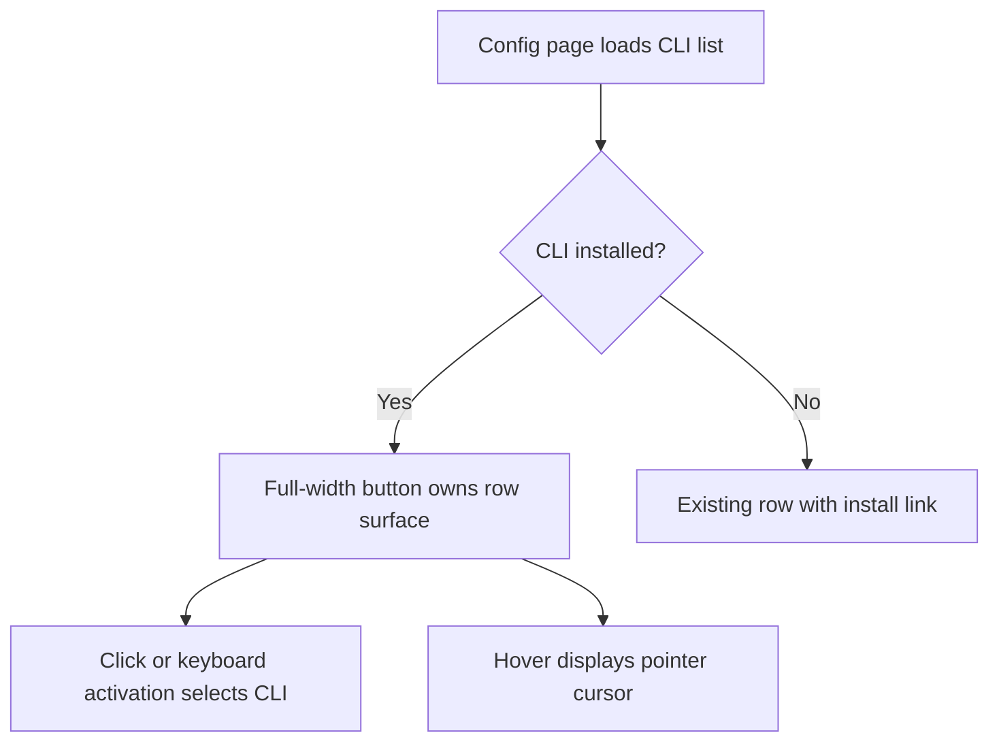

# Feature Plan: Config CLI Choice Hit Area

Status: Implemented

## Context

On `/config`, installed AI CLI choices are rendered as a padded row containing a
narrower inner button. The row padding does not activate the choice, and the
choice does not consistently communicate that it is clickable. The intended
outcome is a single, accessible click target covering the complete installed
CLI row with pointer feedback on hover.

## Scope

### In scope

- Make every installed CLI row clickable across its full visible surface.
- Show a pointer cursor for clickable CLI choices.
- Preserve selection state, keyboard activation, unavailable-CLI install links,
  and existing layout/styling.

### Out of scope

- Changes to CLI detection, persistence, API routes, or configuration behavior.
- Changes to unavailable-CLI rows or the separate AI engine mode cards.

## Acceptance Criteria

- [x] Clicking any horizontal or vertical padding area of an installed CLI row
  selects that CLI.
- [x] Hovering an installed CLI row shows a pointer cursor.
- [x] Keyboard activation of an installed CLI choice still works.
- [x] Unavailable CLI rows retain their install link behavior.

## Current Behavior

`web/src/components/config-form.tsx` renders each CLI as a padded `
` and
puts the selection handler on an inner `<button>`. The parent padding and the
right-side path area are outside that button. The installed button has no
`cursor-pointer` class.

## Proposed Implementation

Render an installed CLI row as one full-width button carrying the existing row
layout, selection handler, keyboard semantics, and `cursor-pointer` feedback.
Keep unavailable rows as non-button containers because they contain an external
install link. Avoid nested interactive elements and avoid changing state or
storage logic.

## Affected Areas

| Area or file | Planned change |
| --- | --- |
| `web/src/components/config-form.tsx` | Make installed CLI rows full-size buttons with pointer feedback; preserve unavailable rows. |
| `web/tests/` | Add a focused regression check if the repository has a suitable component/browser test path; otherwise validate through typecheck and browser interaction. |

## Implementation Steps

1. Replace the installed-row inner button structure with a full-row button while
   retaining the current visual classes and selected state.
2. Add a focused regression test or the closest existing UI verification for
   full-surface activation and pointer styling.
3. Run typecheck/tests and exercise the `/config` flow in a browser if the
   local app and browser tooling are available.

## Test Plan

- Unit or integration tests: no business logic changes; add a regression check
  only if the existing test stack supports this component cleanly.
- Regression tests: verify the installed row has one full-width interactive
  element and retains the install-link path for unavailable tools.
- Playwright or browser verification: click the left/right padding of an
  installed CLI row, confirm selection changes, and inspect the hover cursor.
- Required commands: `npm run typecheck` and `npm test` from `web/`.

## Risks and Assumptions

- Risk: changing the element boundary could subtly affect row sizing; mitigate
  by retaining the existing flex, padding, border, and transition classes.
- Assumption: unavailable CLI rows must continue to expose only their external
  install action, not become selectable.

## Open Questions

- None.
